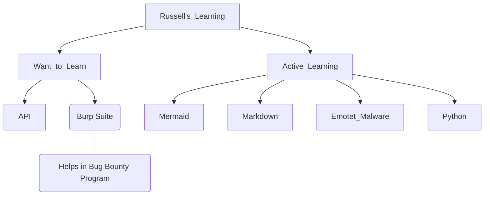

## My Current Learning
I am currently learning how to maintain my github.io website and format blogs with markdown. Thank you to the creators of this awesome jekyll theme.

## Mermaid Diagram

```mermaid
flowchart TD
Russell's_Learning --> Active_Learning
Russell's_Learning --> Want_to_Learn
Want_to_Learn --> API
Want_to_Learn --> D("Burp Suite")
D -.- E("Helps in Bug Bounty Program")
Active_Learning --> Mermaid
Active_Learning --> Markdown
Active_Learning --> Emotet_Malware
Active_Learning --> Python
```

